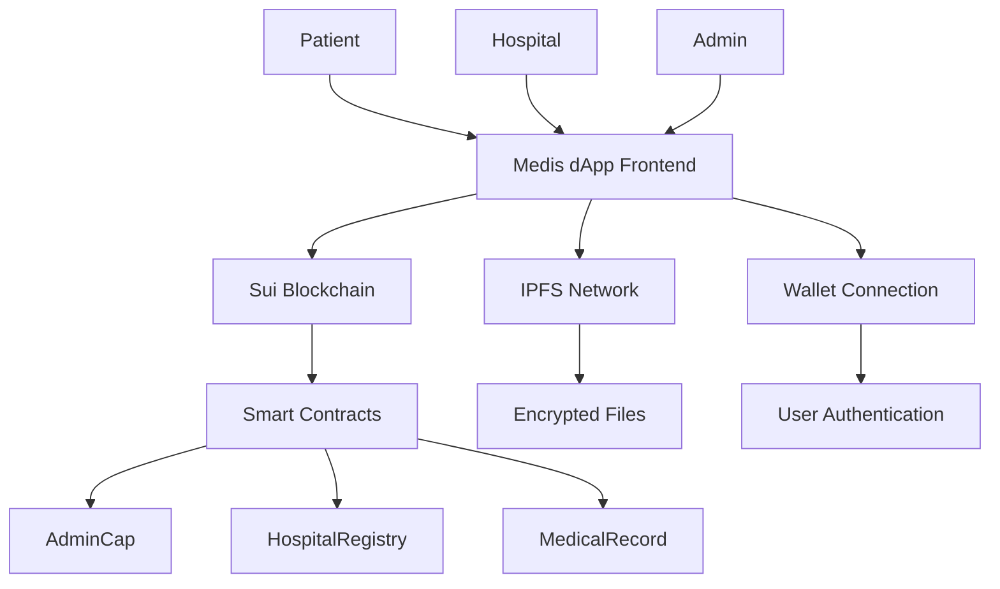

# Medis dApp - Decentralized Medical Records

A complete decentralized application (dApp) for managing medical records on the Sui blockchain with IPFS storage and file encryption.

## 🌟 Features

- **🔐 Secure & Private**: End-to-end encryption for all medical files
- **🌐 Decentralized**: Built on Sui blockchain with IPFS storage
- **👥 Role-Based Access**: Admin, Hospital, and Patient dashboards
- **📱 Modern UI**: Responsive design with Next.js and Tailwind CSS
- **🔗 Wallet Integration**: Latest Sui dApp Kit implementation
- **📄 File Management**: Support for various medical file formats

## 🏗️ Architecture



## 🚀 Quick Start

### Prerequisites

1. **Node.js** (v18 or later)
2. **Sui CLI** - [Installation Guide](https://docs.sui.io/guides/developer/getting-started/sui-install)
3. **Sui Wallet** (Browser extension)

### Installation

1. **Clone and install dependencies**

   ```bash
   git clone <repository-url>
   cd medis-dapp
   npm install
   ```

2. **Deploy smart contracts**

   ```bash
   # For Windows
   npm run deploy:win

   # For Linux/Mac
   npm run deploy:devnet
   ```

3. **Configure environment**

   - Update `.env.local` with deployment object IDs
   - See deployment output for required values

4. **Start development server**

   ```bash
   npm run dev
   ```

5. **Visit application**
   - Open [http://localhost:3000](http://localhost:3000)
   - Connect your Sui wallet

## 📋 Available Scripts

| Command                     | Description              |
| --------------------------- | ------------------------ |
| `npm run dev`               | Start development server |
| `npm run build`             | Build for production     |
| `npm run deploy:devnet`     | Deploy to Sui devnet     |
| `npm run deploy:testnet`    | Deploy to Sui testnet    |
| `npm run deploy:mainnet`    | Deploy to Sui mainnet    |
| `npm run test`              | Run integration tests    |
| `npm run test:contracts`    | Run Move contract tests  |
| `npm run verify-deployment` | Verify deployment status |

## 🎭 User Roles

### 👤 Admin

- **Register hospitals** to the system
- **Manage permissions** for medical institutions
- **Monitor system** activity and statistics
- **Access**: Requires AdminCap ownership

### 🏥 Hospital

- **Issue medical records** to patients
- **Upload encrypted files** to IPFS
- **Track issued records** and patient interactions
- **Access**: Must be registered by Admin

### 👨‍⚕️ Patient

- **View personal medical records**
- **Download encrypted files**
- **Control data access** and permissions
- **Access**: Wallet-based authentication

## 🔧 Smart Contract Functions

### Admin Functions

```move
// Create admin capability
public entry fun create_admin(ctx: &mut TxContext)

// Register a new hospital
public entry fun register_hospital(
    _admin_cap: &AdminCap,
    registry: &mut HospitalRegistry,
    hospital_address: address,
    hospital_name: vector<u8>,
    clock: &Clock,
    ctx: &mut TxContext
)
```

### Hospital Functions

```move
// Issue a medical record
public entry fun issue_record(
    registry: &HospitalRegistry,
    record_registry: &mut MedicalRecordRegistry,
    patient_address: address,
    ipfs_hash: vector<u8>,
    timestamp: u64,
    clock: &Clock,
    ctx: &mut TxContext
)
```

### View Functions

```move
// Check if hospital is registered
public fun is_registered_hospital(
    registry: &HospitalRegistry,
    hospital_address: address
): bool

// Get hospital information
public fun get_hospital_info(
    registry: &HospitalRegistry,
    hospital_address: address
): (String, address, u64)

// Get medical record details
public fun get_record_details(record: &MedicalRecord): (address, address, String, u64, u64)
```

## 🗂️ Project Structure

```
medis-dapp/
├── app/                    # Next.js app directory
│   ├── admin/             # Admin dashboard
│   ├── hospital/          # Hospital dashboard
│   ├── patient/           # Patient dashboard
│   └── layout.tsx         # Root layout with providers
├── components/            # Reusable UI components
│   └── FileUpload.tsx    # File upload component
├── contracts/            # Sui Move smart contracts
│   ├── sources/          # Move source files
│   └── Move.toml         # Move package configuration
├── lib/                  # Utility libraries
│   ├── wallet-provider.tsx    # Wallet context provider
│   ├── wallet-utils.tsx       # Wallet utilities
│   ├── contract-utils.tsx     # Smart contract interactions
│   └── ipfs-utils.tsx         # IPFS and encryption utilities
├── scripts/              # Deployment and utility scripts
│   ├── deploy.sh         # Bash deployment script
│   ├── deploy.ps1        # PowerShell deployment script
│   ├── deployment-utils.ts    # Deployment utilities
│   └── DEPLOYMENT.md     # Deployment guide
└── tests/               # Integration tests
    └── test-runner.ts   # Test suite
```

## 🔐 Security Features

1. **End-to-End Encryption**: All medical files are encrypted before IPFS upload
2. **Blockchain Access Control**: Smart contract enforced permissions
3. **Wallet-Based Authentication**: No centralized user database
4. **IPFS Content Addressing**: Immutable file storage with content hashing
5. **Role-Based Permissions**: Admin, Hospital, and Patient access levels

## 🌐 Network Support

| Network     | Purpose                | Status       |
| ----------- | ---------------------- | ------------ |
| **Devnet**  | Development & Testing  | ✅ Supported |
| **Testnet** | Pre-production Testing | ✅ Supported |
| **Mainnet** | Production Deployment  | ✅ Supported |

## 📄 File Support

Supported medical file formats:

- **Images**: JPEG, PNG, TIFF
- **Documents**: PDF, DOC, DOCX, TXT
- **Medical**: DICOM (planned)
- **Size Limit**: 10MB per file

## 🧪 Testing

### Run All Tests

```bash
npm run test
```

### Test Smart Contracts

```bash
npm run test:contracts
```

### Verify Deployment

```bash
npm run verify-deployment
```

### Test Coverage

- ✅ Network connectivity
- ✅ Smart contract deployment
- ✅ Contract function calls
- ✅ File upload validation
- ✅ Address format validation
- ✅ Environment configuration

## 🚀 Deployment Guide

### 1. Development (Devnet)

```bash
npm run deploy:devnet
```

### 2. Staging (Testnet)

```bash
npm run deploy:testnet
```

### 3. Production (Mainnet)

```bash
npm run deploy:mainnet
```

### Environment Variables

After deployment, update `.env.local`:

```env
NEXT_PUBLIC_SUI_NETWORK=devnet
NEXT_PUBLIC_PACKAGE_ID=0x...
NEXT_PUBLIC_ADMIN_CAP_ID=0x...
NEXT_PUBLIC_HOSPITAL_REGISTRY_ID=0x...
NEXT_PUBLIC_RECORD_REGISTRY_ID=0x...
NEXT_PUBLIC_ENCRYPTION_KEY=your-secure-key
```

## 🔗 Technology Stack

- **Blockchain**: [Sui](https://sui.io/) - Fast, secure, and scalable blockchain
- **Smart Contracts**: [Move](https://move-book.com/) - Safe and expressive programming language
- **Frontend**: [Next.js 15](https://nextjs.org/) - React framework with App Router
- **Styling**: [Tailwind CSS](https://tailwindcss.com/) - Utility-first CSS framework
- **Wallet**: [@mysten/dapp-kit](https://sdk.mystenlabs.com/dapp-kit) - Sui wallet integration
- **Storage**: [IPFS](https://ipfs.io/) via [Helia](https://helia.io/) - Decentralized file storage
- **Encryption**: [CryptoJS](https://cryptojs.gitbook.io/) - File encryption library
- **Icons**: [Lucide React](https://lucide.dev/) - Beautiful & consistent icons

## 📈 Roadmap

- [x] Core smart contract implementation
- [x] Basic UI with three role dashboards
- [x] Wallet integration with latest dApp Kit
- [x] IPFS integration with file encryption
- [x] Deployment scripts and documentation
- [ ] Advanced file format support (DICOM)
- [ ] Mobile application (React Native)
- [ ] Advanced encryption with key management
- [ ] Multi-signature hospital approval
- [ ] Patient consent management system

## 🤝 Contributing

1. Fork the repository
2. Create a feature branch (`git checkout -b feature/amazing-feature`)
3. Commit your changes (`git commit -m 'Add amazing feature'`)
4. Push to the branch (`git push origin feature/amazing-feature`)
5. Open a Pull Request

## 📄 License

This project is licensed under the MIT License - see the [LICENSE](LICENSE) file for details.

## 🆘 Support

- **Documentation**: Check the [deployment guide](scripts/DEPLOYMENT.md)
- **Issues**: Report bugs via GitHub Issues
- **Sui Support**: [Sui Documentation](https://docs.sui.io/)
- **Move Language**: [Move Book](https://move-book.com/)

## 🙏 Acknowledgments

- [Sui Foundation](https://sui.io/) for the amazing blockchain platform
- [Mysten Labs](https://mystenlabs.com/) for the development tools
- [IPFS](https://ipfs.io/) for decentralized storage
- Open source community for the fantastic tools and libraries

---

**Built with ❤️ for decentralized healthcare**
